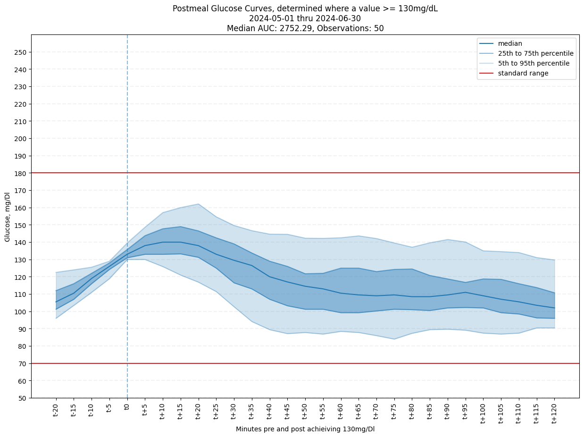
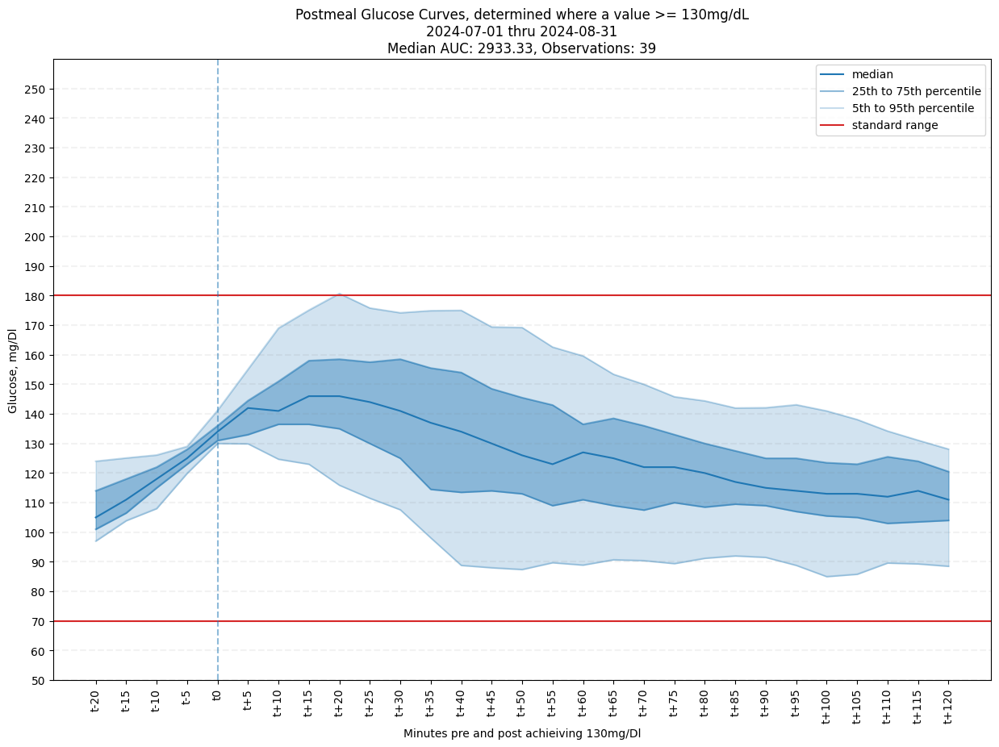

# Describing Glycemic Control Using Data from a FreeStyle Libre 3

FreeStyle Libre provides an in-house reporting tool which allows continuous
glucose monitor (CGM) users the ability to build standardized reports for the
consumption of users and healthcare professionals.

These reports offer great insights that can drive treatment decisions, such as an
estimated A1C; hourly average glucose readings; and a composite glucose graph
which can help describe what ranges patients typically spend their time in.

At the time, I really wanted an answer to another question: how does my body respond to mealtimes, and how can I compare time A vs time B?

I'd just gotten COVID, and while my post-meal readings were the same as before, it
seemed like I was more likely to hit higher numbers between first-bite and before
the 2-hour mark -- way more likely than the previous month.

Looking at the literature, glucose tolerance is commonly measured by taking multiple glucose measurements over a period of time `t`, and then directly comparing the area
under the curve.

# CGMs Can Provide Context

Using Python and the data from my CGM - and borrowing the visual language of
the FreeStlye Libre reports - I built high-resolution descriptive glucose tolerance
curves and calculated the area under the median (mgH/L):

I took these to the doctor (who was not impressed, by the way--like, at all) and
was told that this was normal during an infection and that it'd all go back to normal
in six to eight weeks.

# How to build your own

I've got an example notebook in `docs`, and the method itself in
`src/walking_curves.py`. It relies on `numpy`, `pandas`, and `scikitlearn` for
calculating the AUC.

From your personal database, or more likely LibreView, you need to extract an
ascending-order timeseries of your glucose readings. Then, just pass the array into
the method with the parameters of your choice.

# How it works

The method walks this array until it hits a trigger reading (`center`), and then it slices a given `n` readings before and `n` readings after.

These same-shape-same-center arrays are then assembled into a matrix to determine quantile-level descriptions at each `n` step, and the median is used to calculate
the AUC, assuming the data is collected at 5 minute intervals.

The method does **not** generate pretty graphs, but I've included the code I used
to assemble the graphs for user reference.